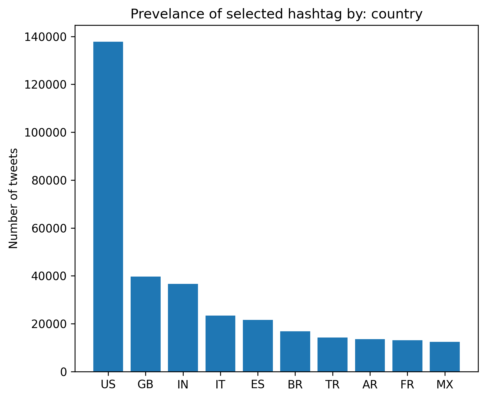
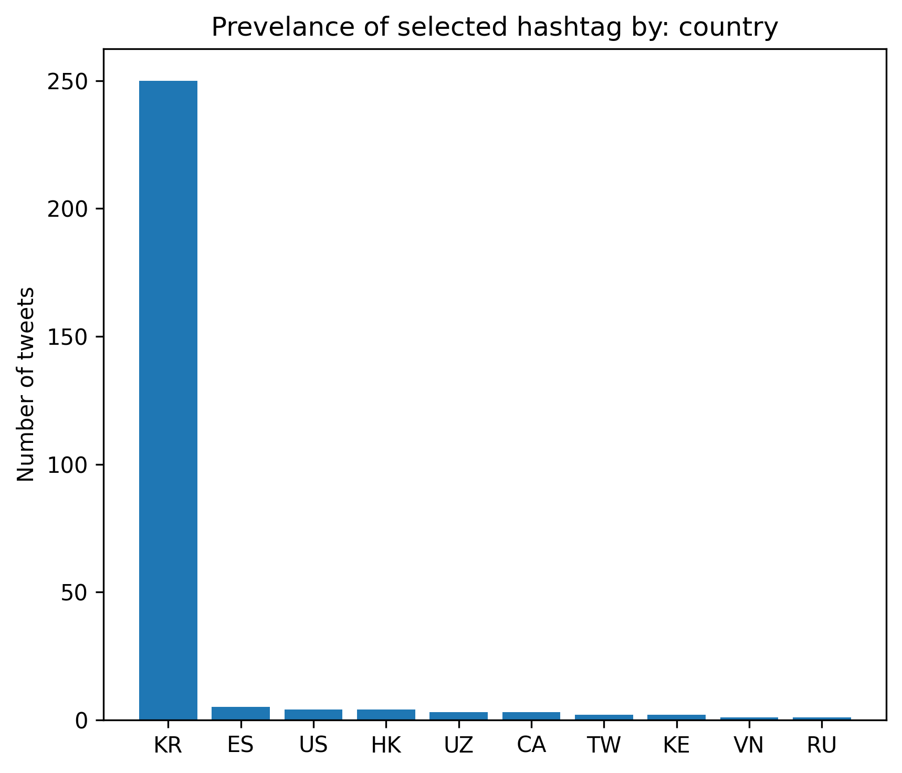
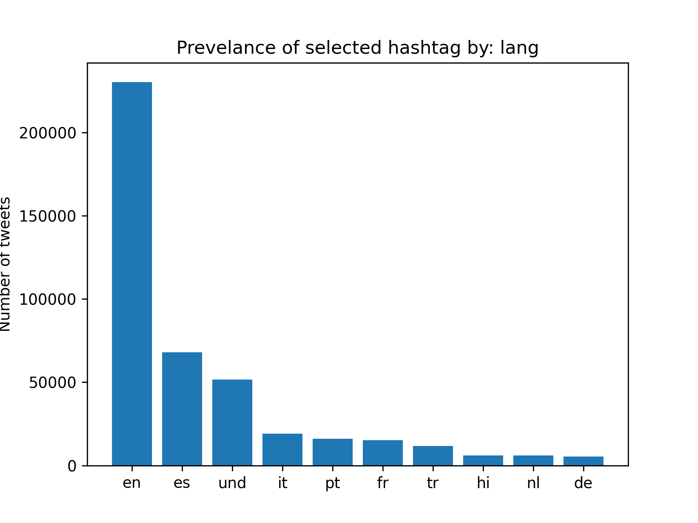
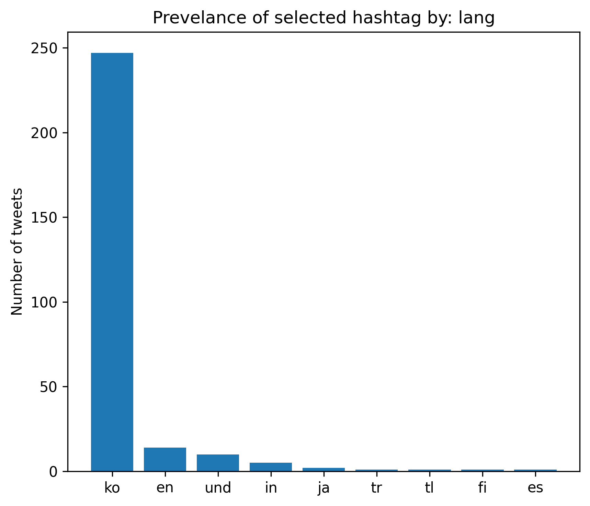

# Coronavirus tweet analysis

**Overview**

In this project, I analyzed geotagged tweets in 2020 for the prevelance of the certain hashtags as tracked against other tweet metadata. Specifically, I looked at the prevalance of the hashtags related to coronavirus (see `./hashtags`) against tweet language, tweet origin country, and tweet date. To carry out this analysis, I used MapReduce to process and parse a dataset of one billion geotagged tweets.

**Sample Findings** 

